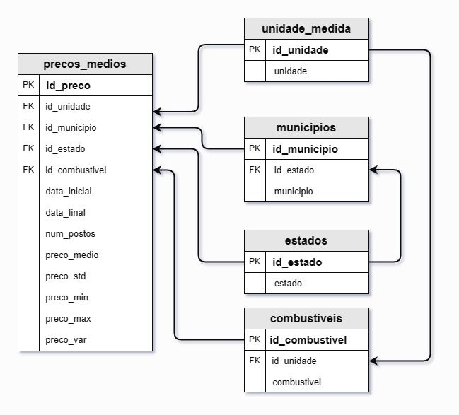
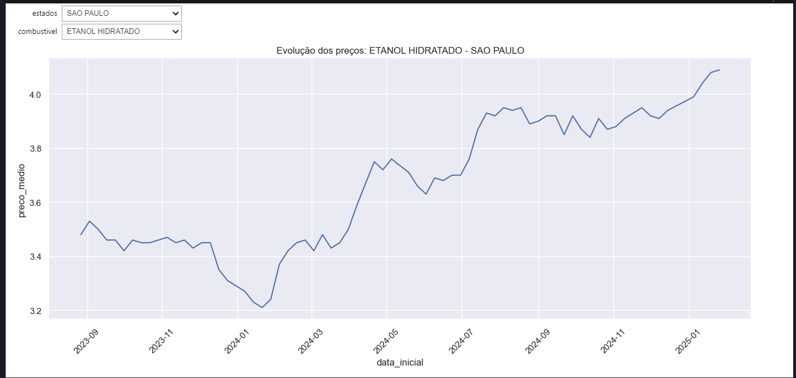

# ETL ANP Preços Médios de Combustíveis


Projeto de ETL (Extração, Transformação e Carga) para dados de preços médios de combustíveis disponibilizados pela Agência Nacional do Petróleo (ANP). Os dados são processados, armazenados em um banco de dados SQLite e visualizados através de gráficos interativos.

## 📌 Funcionalidades

- **Extração Automática**: Baixa dados semanais diretamente do portal da ANP via API  com a classe criada.
- **Transformação de Dados**:
  - Normalização de entidades (combustíveis, estados, municípios, unidades de medida).
  - Validação de consistência de dados históricos.
- **Modelagem de Banco de Dados**:
  - Criação de tabelas relacionais (combustíveis, estados, municípios, preços médios).
  - Carga incremental de dados.
- **Visualização Interativa**: Gráficos dinâmicos com filtros por estado e tipo de combustível.
- **Atualização Automática**: Verificação de alterações nos dados históricos da ANP.

## 🚀 Como Reproduzir:

1. Clone o repositório:

```bash
git clone https://github.com/AurelioGuilherme/ANP-ETL.git
cd ANP-ETL
```
2. Instale as dependências:

```bash
pip install -r requirements.txt
```
3. Execução do Notebook:

Abra o Jupyter Notebook `etl.ipynb` e execute todas as células.

4. Acesse o Banco de Dados:

Um arquivo combustiveis.db foi gerado com todas as tabelas estruturadas.

''''''

Use ferramentas como DB Browser for SQLite para explorar os dados.

5. Visualização de Dados:

Gráficos interativos são gerados automaticamente no notebook, use os dropdowns para filtrar por estado e tipo de combustível conforme visualização abaixo.
''''''
